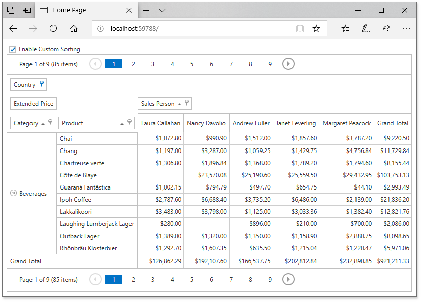

*Files to look at*:

* [Index.cshtml](.CS/DXWebApplication19/Views/Home/Index.cshtml)
* [_PivotGridPartial.cshtml](.CS/DXWebApplication19/Views/Home/_PivotGridPartial.cshtml)
* [HomeController.cs](./CS/DXWebApplication19/Controllers/HomeController.cs)

# CustomFieldSort - How to Use a Hidden Field to Sort the Visible Field

This example demonstrates how to sort a field (_Sales_Person)_ by the hidden data field values (_LastName_).

Check the _Enable Custom Sorting_ box to sort the _Sales_Person_ values by _LastName_ instead of the default alphabetical sorting order.

The enabled check box switches the [PivotGridField.SortMode](https://docs.devexpress.com/CoreLibraries/DevExpress.XtraPivotGrid.PivotGridFieldBase.SortMode) property to the **Custom** value. This setting allows the PivotGridControl to fire the **CustomFieldSort** event for that field using the [PivotGridSettings.CustomFieldSort](https://docs.devexpress.com/AspNet/DevExpress.Web.Mvc.PivotGridSettings.CustomFieldSort) property.

The CustomFieldSort handler checks the [e.SortLocation](https://docs.devexpress.com/AspNet/DevExpress.Web.ASPxPivotGrid.PivotGridCustomFieldSortEventArgs.SortLocation) property to determine whether the field values are displayed in the pivot grid, or in the filter popup. 

If the field is displayed in the pivot grid, the code compares values obtained from the _LastName_ column and assigns the result to the [e.Result](https://docs.devexpress.com/AspNet/DevExpress.Web.ASPxPivotGrid.PivotGridCustomFieldSortEventArgs.Result) property.

If the field is displayed in the filter popup, the [e.ListSourceRowIndex1](https://docs.devexpress.com/AspNet/DevExpress.Web.ASPxPivotGrid.PivotGridCustomFieldSortEventArgs.ListSourceRowIndex1) and [e.ListSourceRowIndex2](https://docs.devexpress.com/AspNet/DevExpress.Web.ASPxPivotGrid.PivotGridCustomFieldSortEventArgs.ListSourceRowIndex2) properties are always -1 and cannot be used to indicate the underlying data row. In this situation, the comparison algorithm processes the field value itself.

API in this example:

* [PivotGridField.SortMode](https://docs.devexpress.com/CoreLibraries/DevExpress.XtraPivotGrid.PivotGridFieldBase.SortMode) property
* [PivotSortMode](https://docs.devexpress.com/CoreLibraries/DevExpress.XtraPivotGrid.PivotSortMode) enumeration
* [PivotGridSettings.CustomFieldSort](https://docs.devexpress.com/AspNet/DevExpress.Web.Mvc.PivotGridSettings.CustomFieldSort) Property
* [PivotGridCustomFieldSortEventArgs.SortLocation](https://docs.devexpress.com/AspNet/DevExpress.Web.ASPxPivotGrid.PivotGridCustomFieldSortEventArgs.SortLocation) property
* [PivotGridCustomFieldSortEventArgs.ListSourceRowIndex1](https://docs.devexpress.com/AspNet/DevExpress.Web.ASPxPivotGrid.PivotGridCustomFieldSortEventArgs.ListSourceRowIndex1) property
* [PivotGridCustomFieldSortEventArgs.ListSourceRowIndex2](https://docs.devexpress.com/AspNet/DevExpress.Web.ASPxPivotGrid.PivotGridCustomFieldSortEventArgs.ListSourceRowIndex2) property
* [PivotGridCustomFieldSortEventArgs.Value1](https://docs.devexpress.com/AspNet/DevExpress.Web.ASPxPivotGrid.PivotGridCustomFieldSortEventArgs.Value1) property
* [PivotGridCustomFieldSortEventArgs.Value2](https://docs.devexpress.com/AspNet/DevExpress.Web.ASPxPivotGrid.PivotGridCustomFieldSortEventArgs.Value2) property
* [PivotGridCustomFieldSortEventArgs.GetListSourceColumnValue](https://docs.devexpress.com/AspNet/DevExpress.Web.ASPxPivotGrid.PivotGridCustomFieldSortEventArgs.GetListSourceColumnValue(System.Int32-System.String)) method
* [PivotGridCustomFieldSortEventArgs.Result](https://docs.devexpress.com/AspNet/DevExpress.Web.ASPxPivotGrid.PivotGridCustomFieldSortEventArgs.Result) property
* [PivotGridCustomFieldSortEventArgs.Handled](https://docs.devexpress.com/AspNet/DevExpress.Web.ASPxPivotGrid.PivotGridCustomFieldSortEventArgs.Handled) property

**See also:**

* [Data Sorting](https://docs.devexpress.com/AspNet/7276/)
* [Binding to Data using Entity Framework (Code First)](https://docs.devexpress.com/AspNet/18054/asp.net-mvc-extensions/pivot-grid/binding-to-data/binding-to-data-using-entity-framework-code-first)